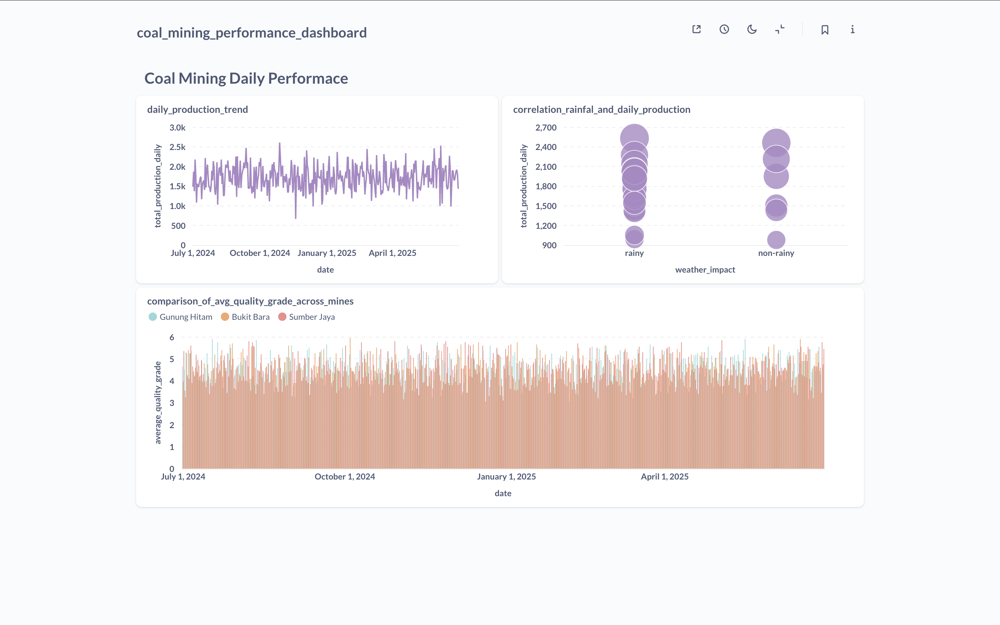
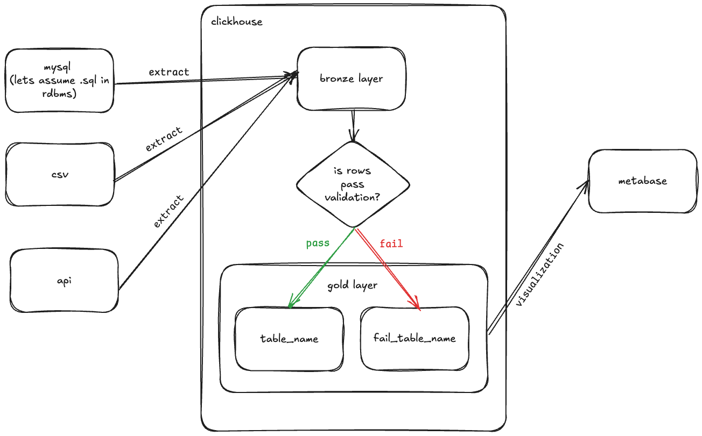
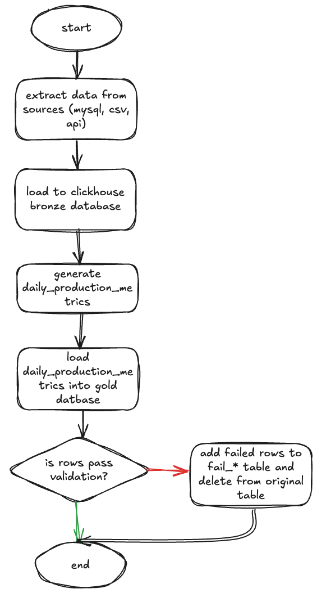

# Synapsis Coal Mining Data Warehouse

## Note
- high level document / brief report:
    
    https://docs.google.com/document/d/1cxIKmwQk272VGHpsj-v04sR7NjxDxVgf9T2Gi6ERt5k
- metabase dashboard:

    

## Features
1. Automating creating tables
2. Automating validation / quality test, separate rows that not pass validation
3. Run whole project with minimal setting

## Architecture


## Requirements
1. Docker
2. Docker compose

## How to Run
1. clone this project
2. run `cd synapsis-coal-mining`
2. Modify `.env` file except vars [optional]:

     ```
     *_HOSTNAME=
     API_PARAM_START_DATE=start_date_to_get_weather_data_from_api
     API_PARAM_END_DATE=end_date_to_get_weather_data_from_api
     PROJECT_DATA_DIR=initial_data_project
     PROJECT_QUERIES_DIR=initial_queries_dir
     QUERIES_FILENAME=queries_path_to_create_layer_gold
    ```
3. run `docker-compose up --build`

## Flowchart

